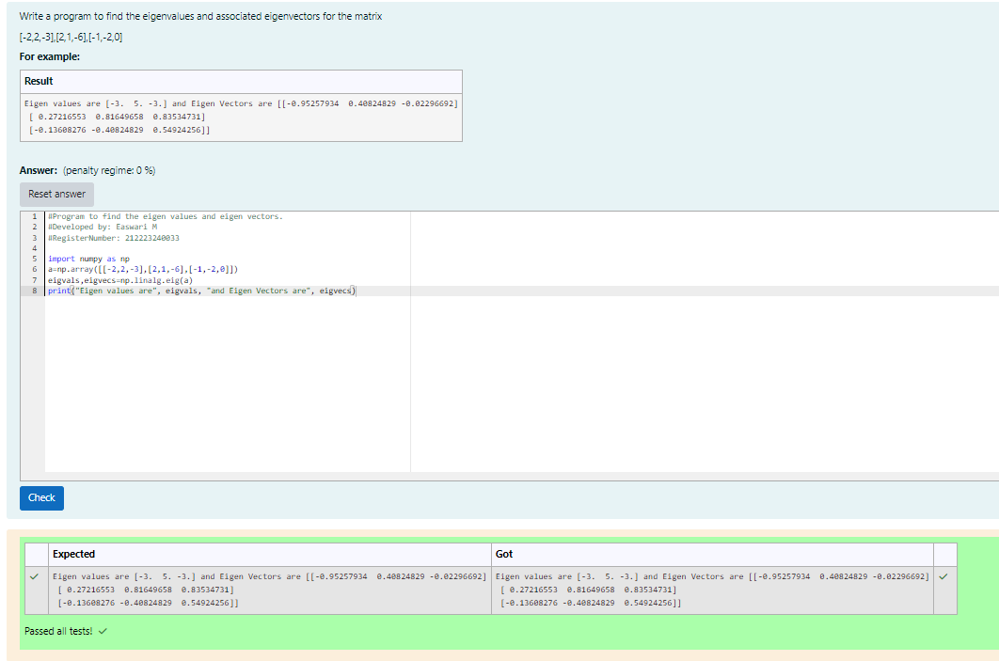

# EIGENVALUES-AND-EIGENVECTORS
## Aim:
To write a python program to find the Eigenvalues and Eigen Vectors
## Equipment’s required:
1. 	Hardware – PCs
2. 	Anaconda – Python 3.7 Installation / Moodle-Code Runner
## Algorithm:
### Step1 : Import numpy as np.
### Step 2: Assign np.array() in eigen values and eigen vectors
### Step 3: Using the np.linalg.eig(),  we get two results (first is eigenvalue and second is eigenvector) of the given matrix.
### Step 4: Print both the values and vectors, then end the program.

## Program:
```
#Program to find the eigen values and eigen vectors.

#Developed by: Easwari M
#RegisterNumber: 212223240033

import numpy as np
a=np.array([[-2,2,-3],[2,1,-6],[-1,-2,0]])
eigvals,eigvecs=np.linalg.eig(a)
print("Eigen values are", eigvals, "and Eigen Vectors are", eigvecs)
```

## Output:



## Result:
Thus the Eigenvalue and Eigenvector is successfully solved using python program
